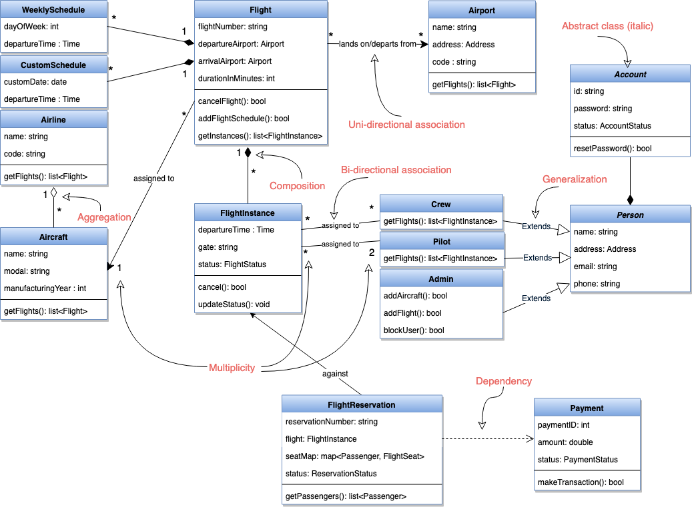

# use case diagram

describe a set of actions, that a system sould or can perform in collaboration with one or more external users of the systems(actors):

Each use case should provide some observable and valuable result to the actors.

1. Use Case Diagrams describe the high-level functional behavior of the system.
2. It answers what system does from the user point of view.
3. Use case answers ‘What will the system do?’ and at the same time tells us ‘What will the system NOT do?’.

The primary purpose of the use case diagram is to help development teams visualize the functional requirements of a system, including the relationship of “actors” to the essential processes, as well as the relationships among different use cases.

## use case diagram

- System boundary: A system boundary defines the scope and limits of the system. It is shown as a rectangle that spans all use cases of the system.

- Actors: An actor is an entity who performs specific actions. These roles are the actual business roles of the users in a given system. An actor interacts with a use case of the system. For example, in a banking system, the customer is one of the actors.

- Use Case: Every business functionality is a potential use case. The use case should list the discrete business functionality specified in the problem statement.

- Include: Include relationship represents an invocation of one use case by another use case. From a coding perspective, it is like one function being called by another function

- Extend: This relationship signifies that the extended use case will work exactly like the base use case, except that some new steps will be inserted in the extended use case.

## class diagram:

Class diagram is the backbone of object-oriented modeling - it shows how different entities (people, things, and data) relate to each other. In other words, it shows the static structures of the system.

A class diagram describes the attributes and operations of a class and also the constraints imposed on the system.

- The purpose of the class diagram can be summarized as:

1. Analysis and design of the static view of an application;
2. To describe the responsibilities of a system;
3. To provide a base for component and deployment diagrams; and,
4. Forward and reverse engineering.
   

Aggregation: Aggregation is a special type of association used to model a “whole to its parts” relationship. In a basic aggregation relationship, the lifecycle of a PART class is independent of the WHOLE class’s lifecycle. In other words, aggregation implies a relationship where the child can exist independently of the parent. In the above diagram, Aircraft can exist without Airline.

Composition: The composition aggregation relationship is just another form of the aggregation relationship, but the child class’s instance lifecycle is dependent on the parent class’s instance lifecycle. In other words, Composition implies a relationship where the child cannot exist independent of the parent. In the above example, WeeklySchedule is composed in Flight which means when Flight lifecycle ends, WeeklySchedule automatically gets destroyed.

Generalization: Generalization is the mechanism for combining similar classes of objects into a single, more general class. Generalization identifies commonalities among a set of entities. In the above diagram, Crew, Pilot, and Admin, all are Person.

Dependency: A dependency relationship is a relationship in which one class, the client, uses or depends on another class, the supplier. In the above diagram, FlightReservation depends on Payment.

Abstract class: An abstract class is identified by specifying its name in italics. In the above diagram, both Person and Account classes are abstract classes.

## sequence dagram:

Sequence diagrams show a detailed flow for a specific use case or even just part of a particular use case. They are almost self-explanatory; they show the calls between the different objects in their sequence and can explain, at a detailed level, different calls to various objects.

## activity diagram:

We use Activity Diagrams to illustrate the flow of control in a system. An activity diagram shows the flow of control for a system functionality; it emphasizes the condition of flow and the sequence in which it happens. We can also use an activity diagram to refer to the steps involved in the execution of a use case.

Activity diagram captures the process flow. It is used for functional modeling. A functional model represents the flow of values from external inputs, through operations and internal data stores, to external outputs.

Sequence diagram tracks the interaction between the objects. It is used for dynamic modeling, which is represented by tracking states, transitions between states, and the events that trigger these transitions.
